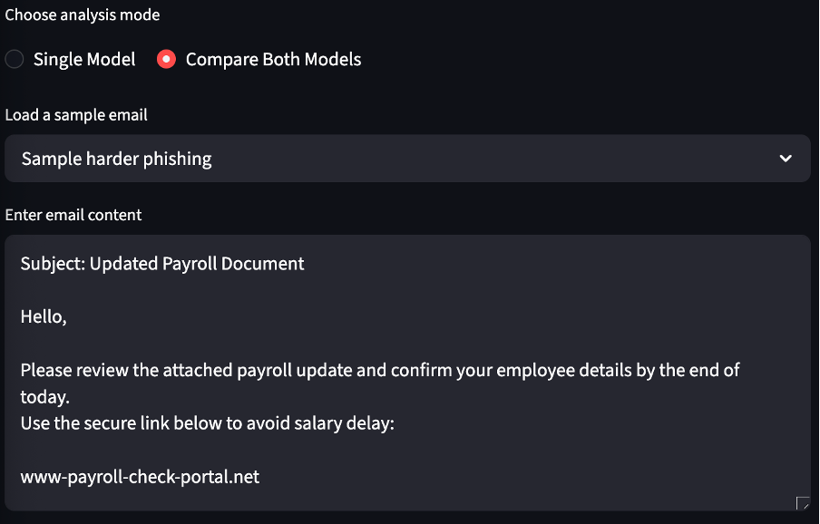
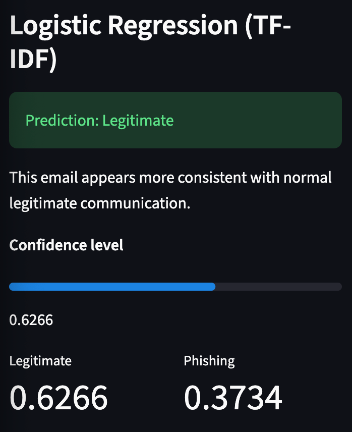
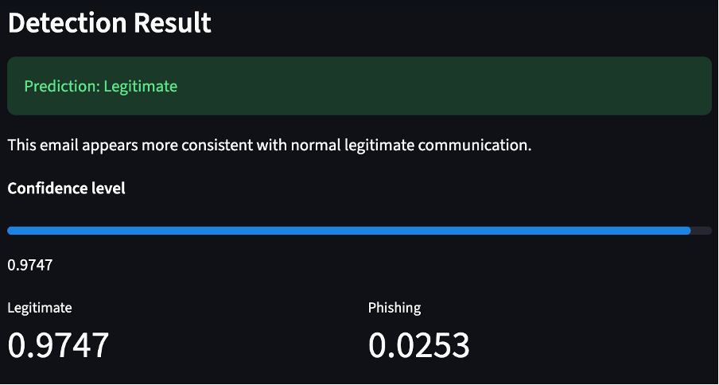
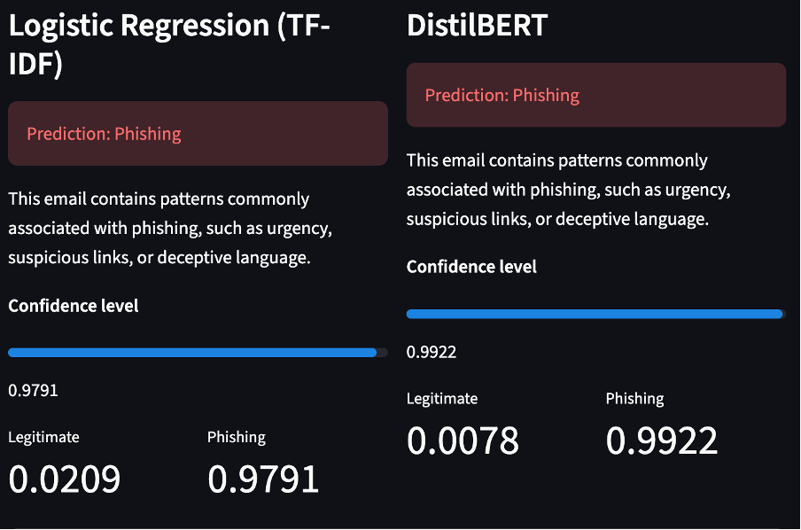

# AI-Powered Phishing Email Detection System

An AI-powered phishing email detection system developed as a final-year cybersecurity project. The application uses both traditional Machine Learning and modern Natural Language Processing techniques to classify emails as **Phishing** or **Legitimate**, while allowing users to compare model predictions through an interactive Streamlit interface.

---

## Project Overview

Phishing remains one of the most common cyber threats affecting individuals and organisations worldwide. Traditional rule-based email filters often struggle to detect modern phishing attacks, especially those generated using AI.

This project investigates whether machine learning and transformer-based NLP models can improve phishing email detection by comparing two different approaches:

- **Logistic Regression with TF-IDF**
- **DistilBERT Transformer**

A Streamlit web application was developed to demonstrate real-time email classification and side-by-side model comparison.

---

## Features

- Email text preprocessing and cleaning
- TF-IDF feature extraction
- Logistic Regression baseline classifier
- DistilBERT transformer classifier
- Real-time email classification
- Confidence scores and prediction probabilities
- Side-by-side comparison of both models
- Interactive Streamlit interface
- Sample phishing and legitimate emails included for testing

---

## 📸 Application Preview

### Home Screen



### Phishing Email Detection



### Legitimate Email Detection



### Model Comparison



---

## Technologies Used

| Technology | Purpose |
|------------|---------|
| Python | Programming language |
| Streamlit | Web application |
| Scikit-learn | Machine Learning |
| Hugging Face Transformers | DistilBERT implementation |
| PyTorch | Deep learning backend |
| Pandas | Data processing |
| NumPy | Numerical computing |
| Matplotlib | Visualisations |
| Jupyter Notebook | Model development |

---

## Machine Learning Pipeline

```
Raw Email
      │
      ▼
Text Cleaning
      │
      ▼
Feature Extraction
 ├── TF-IDF
 └── DistilBERT Tokenizer
      │
      ▼
Classification
 ├── Logistic Regression
 └── DistilBERT
      │
      ▼
Prediction + Confidence Score
      │
      ▼
Streamlit Interface
```

---

## Project Structure

```
ai-phishing-email-detector/

├── data/
│   ├── raw/
│   └── processed/
│
├── notebooks/
│   ├── 01_data_exploration.ipynb
│   └── 02_distilbert_model.ipynb
│
├── saved_models/
│   ├── logistic_regression_model.pkl
│   ├── tfidf_vectorizer.pkl
│   └── distilbert_phishing_model/
│
├── src/
│   ├── app/
│   ├── models/
│   └── preprocessing/
│
├── requirements.txt
└── README.md
```

---

## Dataset

The project combines two publicly available datasets:

- **Enron Email Dataset** (Legitimate emails)
- **EduPhish Dataset** (Phishing emails)

The datasets were:

- cleaned
- merged
- balanced
- normalised

before model training.

> Large datasets are excluded from this repository because of GitHub file size limits.

---

## Models

### Logistic Regression

- TF-IDF Vectorizer
- Fast inference
- High interpretability
- Strong baseline performance

### DistilBERT

- Transformer-based NLP model
- Context-aware language understanding
- Better semantic representation
- Higher computational requirements

---

## Evaluation

Both models were evaluated using:

- Accuracy
- Precision
- Recall
- F1 Score
- Confusion Matrix

The project found that:

- Logistic Regression produced stable, efficient, and interpretable results.
- DistilBERT captured contextual information more effectively and was particularly strong at identifying sophisticated phishing emails, although it required greater computational resources.

---

## Streamlit Application

The web interface allows users to:

- Enter custom email text
- Select a classification model
- Compare both models simultaneously
- View confidence scores
- Test built-in phishing examples

---

## Installation

Clone the repository

```bash
git clone https://github.com/Trevorufumwen/ai-phishing-email-detector.git
```

Navigate into the project

```bash
cd ai-phishing-email-detector
```

Install dependencies

```bash
pip install -r requirements.txt
```

Run the application

```bash
streamlit run src/app/app.py
```

---

## Repository Notes

The following large files are intentionally excluded:

- training datasets
- DistilBERT model weights (`model.safetensors`)

This keeps the repository lightweight while preserving the source code and supporting files.

---

## Future Improvements

- Train using larger and more diverse phishing datasets
- Incorporate email headers and URL analysis
- Replace undersampling with SMOTE
- Optimise transformer inference speed
- Deploy as a cloud-hosted web application
- Integrate with email clients
- Add Explainable AI (XAI) visualisations

---

## Author

**Trevor Ufumwen**

Final Year BSc Computing Project

University of Greenwich

---

## License

This project is released under the MIT License.
